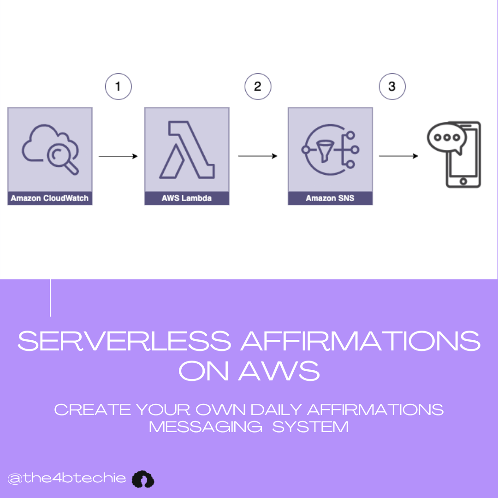

# Serverless Affirmations
A daily affirmation sender that is created with a serverless architecture. The 3 AWS Services used is:
- AWS Lambda: A compute service that lets you run code without provisioning or managing servers. Can run code for most popular languages
- Cloudwatch-Event: Delivers a near real-time stream of system events that describe changes in your environment. Can be used to trigger  resources based on events or time based rules
- Simple Notification Service (SNS): Fully managed messaging service for both application-to-application (A2A) and application-to-person (A2P) communication.

This solution is set up to run using the free tier of these services in AWS

## Solution Diagram

1. A time based rule is set on Cloudwatch Events to trigger a Lambda Function every day
2. A lambda function runs that will select an affirmation from a JSON file and invoke SNS to send the message
3. Once a SNS Topic gets the message to publish it will send the affirmation out to any users subscribed to the topic. Please note it's currently set up for email protocol to stay within the free tier range. SMS is possible for this to receive text messages but cost may occur to set up phone registration, read https://docs.aws.amazon.com/pinpoint/latest/developerguide/tutorials-two-way-sms.html for more info

## Deployment
To deploy the solution, navigate to  CloudFormation and create a stack. Upload a template file and select the 'solutionTemplate.json'. This will prompt you for stack name where you can name the solution of your choice and put the email that you would like to receive notifications on under the field for Email in the Parameter section. Accept all default configurations and on the final review page under Capabilities, click the acknowledgement for CloudFormation to create IAM resources with custom names.

Once stack has finished creating, you can navigate to resources to view all resources created.

Navigate to the lambda function console to upload the additional code: 'lambda_function.py' from this repo can be uploaded and add the 'affirmations.json' to store the affirmations. Feel free to modify that file with your own favorite affirmations!
